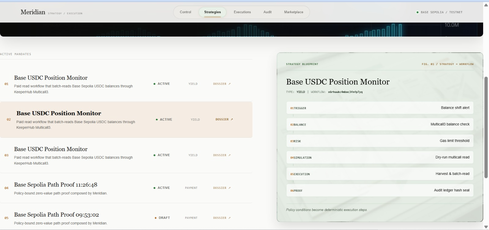
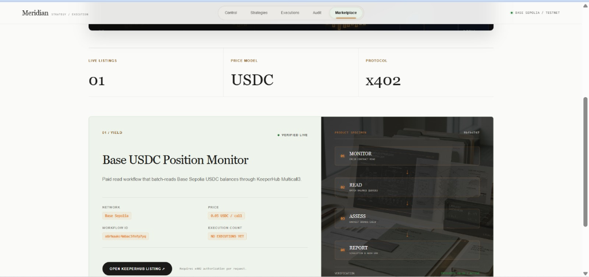
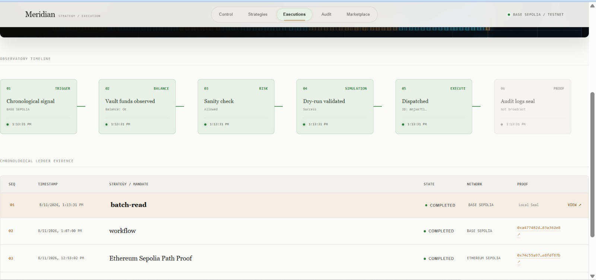
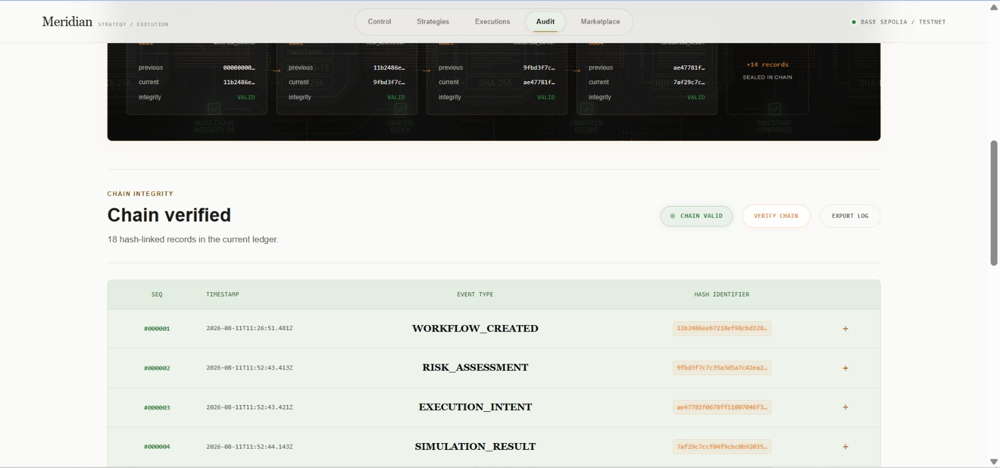
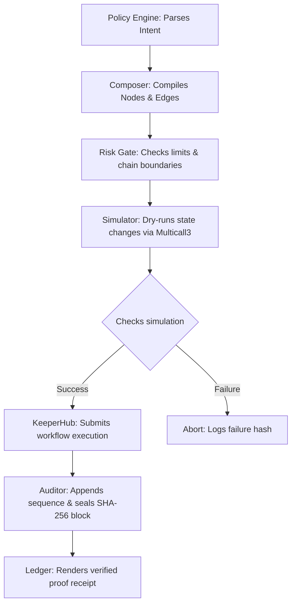

# MERIDIAN

<p align="center">
  <strong>Continuous autonomous onchain strategy execution. Audit. Verify. Settle.</strong>
</p>

<p align="center">
  
  
  
  
</p>

<p align="center">
  
</p>

> **Meridian is an autonomous onchain strategy execution system.**
> 
> It translates high-level strategy intents (such as dollar-cost averaging, scheduled payments, yield monitoring, and portfolio rebalances) into structured KeeperHub workflows. Every write operation is locally risk-scored, simulated prior to broadcast, idempotently submitted, receipt-verified, and sealed in an append-only, tamper-evident SHA-256 hash chain.

**Passive vaults trust blackbox operations. Meridian verifies the last mile.**

---

## Live Links

| Resource | Link |
|---|---|
| **Live Site** | [https://meridian-keeper-hub.vercel.app/](https://meridian-keeper-hub.vercel.app/) |
| **GitHub** | [https://github.com/0xkinno/meridian](https://github.com/0xkinno/meridian) |
| **Demo Video** | [Watch on YouTube](https://youtu.be/wau9uV-OCPU?si=NmOQ0FKcWg9F8rlp) |

---

## Live Demonstration Milestones

Below is the verified ledger of onchain actions executed via KeeperHub and recorded in Meridian's cryptographic audit ledger during live testnet milestones:

| # | Action | Network | Chain ID | Transaction Hash | KeeperHub Execution ID | Type |
|---|---|---|---|---|---|---|
| **01** | Zero-value self-transfer | Base Sepolia | 84532 | [0xace7…eee8](https://sepolia.basescan.org/tx/0xace7b26b5177cd9d66fa72ab05da115e3e0ef0e523ed5926952f6b51a2d0eee8) | `4g3kvybubme56puv5idvu` | Direct Execution |
| **02** | Zero-value self-transfer | Ethereum Sepolia | 11155111 | [0x74c5…f67b](https://sepolia.etherscan.io/tx/0x74c55a975b1c0aed97f9c1ec0fba00adad52e7ee58d2268b80db39b9e8fdf67b) | `cc900irb4slprzw0rwfo8` | Direct Execution |
| **03** | Scheduled payment workflow | Base Sepolia | 84532 | [0xa477…62e8](https://sepolia.basescan.org/tx/0xa477482dba74d2daf61c2b8e370f8e302c9c02426f231c6ee785133e63a362e8) | `6n1qz0qzqy099zbly1ocq` | Workflow Execution |
| **04** | USDC Multicall3 balance read | Base Sepolia | 84532 | N/A (read-only verification) | `mnjxe7tl88swpcrvfcum1` | Batch Read Workflow |

### Marketplace Listing Proof
- **Authorized Listing Slug:** `meridian-base-usdc-monitor-9bfbd747`
- **Authorized Price Model:** `0.05` USDC/call
- **x402 Protocol Enforcement:** Invocation without a valid payment key yields an authoritative HTTP 402 Payment Required challenge.

---

## Product Screenshots

Symmetrically aligned interface captures demonstrating Meridian's premium, magazine-grade visual design:

| Strategies Dashboard | Market Place |
|:---:|:---:|
|  |  |
| **Executions Observatory** | **Forensic Audit Ledger** |
|  |  |

---

## The Problem

Autonomous onchain policies collapse at the **last mile**. 

While AI agents can reason about what *should* happen (e.g., "rebalance portfolio when drift exceeds 5%"), they cannot reliably settle those actions onchain. Executing a raw transaction requires addressing a cascade of systems failures: checking token balances, simulating preflight state changes, estimating gas limits, avoiding revert errors, preventing duplicate nonce submissions, monitoring receipt states, and keeping a tamper-evident audit record.

If these execution steps are managed in a black box, operations become un-auditable, silent failures go unnoticed, and funds are exposed to front-running or incorrect broadcasts.

---

## The Solution

Meridian separates **strategy policy** from **execution settlement**.

It introduces a local, deterministic rule engine that parses strategy parameters, compiles them into structured Node-Edge graphs compatible with KeeperHub, and coordinates the execution loop. Before any transaction hits the network, Meridian runs a local dry-run preflight check. Post-execution, the transaction receipt is cryptographically sealed in a local SHA-256 hash ledger, ensuring complete operational transparency.

---

## How It Works



---

## Architecture

```
+--------------------------------------------------------------------+
|               Next.js 14 App Router (Premium Editorial UI)         |
|  +------------------------+    +--------------------------------+  |
|  | Dashboard/Control      |    | Executions Observatory         |  |
|  | Live Telemetry console |    | Horizontal timeline stages     |  |
|  | Dynamic Strategy spreads|   | Forensic Evidence Ledger       |  |
|  +----------+-------------+    +---------------+----------------+  |
+-----------  |  -------------------------------- | -----------------+
              | API Endpoint Handshakes & JSON Payloads
              v                                   
+--------------------------------------------------------------------+
|                         MERIDIAN ENGINE                            |
|                                                                    |
|  POLICY TRANSLATION              EXECUTION PIPELINE                |
|  - Strategy configuration parser - Local risk constraint validator |
|  - Graph layout compiler         - Preflight contract simulator   |
|  - KeeperHub REST request mapper - Poller / receipt verifier       |
|  - MCP Tool client handler       - SHA-256 chain log generator     |
+----------------------------+---------------------------------------+
                             |
                             v
+--------------------------------------------------------------------+
|                     Persistence + Onchain Gateway                  |
|                                                                    |
|  Local JSON File Storage           KeeperHub Infrastructure        |
|  - `data/strategies.json`          - REST API REST-gateway         |
|  - `data/executions.json`          - MCP Session tools             |
|  - `data/audit.jsonl` (Ledger)     - Base/Ethereum Sepolia Nodes   |
+--------------------------------------------------------------------+
```

---

## Key Features

### 1. Zero-Trust Policy Engine
Translates human financial rules (e.g. *"Transfer 10 USDC every 24 hours"*) into explicit JSON schemas. This engine is completely deterministic and runs local safety validations, preventing any LLM-induced drift from altering target addresses, transfer amounts, or execution frequencies.

### 2. Preflight Simulation
Uses local dry-runs to validate state conditions before gas is paid or assets are broadcast. For balance monitors, it bundles multiple contract queries into a single atomic Multicall3 transaction, ensuring fast verification with minimal network overhead.

### 3. Local Risk Constraints
Applies a defensive validation layer that checks execution limits before forwarding calls to KeeperHub. If a transaction attempts to route outside approved networks (Base/Ethereum Sepolia), exceeds transfer bounds, or targets un-whitelisted wallets, Meridian aborts and logs the warning.

### 4. Tamper-Evident SHA-256 Audit Trail
Maintains an append-only cryptographic ledger (`data/audit.jsonl`). Each node assessment, simulation, and execution creates a block that hashes its sequence, timestamp, payload, and the previous block's hash. The integrity of the entire history can be verified instantly with one click.

### 5. x402 Token Gate & Marketplace Integration
Enforces paid access boundaries. When strategies are published to the Marketplace, they require an x402 payment key. Unpaid requests trigger a `402 Payment Required` challenge, verifying the commercial loop for autonomous agent calls.

---

## KeeperHub Surfaces Utilized

| Surface | Meridian Usage |
|---|---|
| **REST API Gateway** | Authentication handshake, workflow CRUD operations, direct execution broadcasting, and transaction status polling. |
| **MCP Session** | Tool discovery, capability validation, and remote marketplace listing price initialization. |
| **Direct Execution** | Preflight balance verification and zero-value self-transfer operations on Sepolia testnets. |
| **Workflow Builder** | Connecting schedule triggers, conditional checks, contract reads, and asset transfer nodes. |
| **USDC Multicall3** | Bundling multiple token check reads into one efficient blockchain query. |
| **Gas Optimization** | Adjusting gas limit multipliers and verifying sponsored execution rules. |

---

## Data Model

```
STRATEGY_RECORD {
  id: String (UUID)
  name: String
  type: 'dca' | 'payment' | 'yield' | 'rebalance'
  description: String
  config: {
    chainId: Number
    tokenAddress: String
    targetAddress: String
    amount: String
    intervalSeconds: Number
  }
  keeperHubWorkflowId?: String
  marketplaceSlug?: String
  marketplacePrice?: String
  executionCount: Number
  createdAt: String
}

EXECUTION_RECORD {
  id: String (UUID)
  strategyId?: String
  strategyName?: String
  keeperHubExecutionId: String
  kind: 'direct' | 'workflow' | 'batch-read' | 'marketplace'
  status: 'pending' | 'processing' | 'completed' | 'failed' | 'skipped'
  chainId: Number
  network: String
  simulation?: {
    success: Boolean
    gasEstimate?: String
    error?: String
  }
  risk?: {
    level: 'low' | 'medium' | 'high'
    score: Number
  }
  transactionHash?: String
  transactionLink?: String
  sponsored?: Boolean
  error?: String
  createdAt: String
}

AUDIT_LOG_ENTRY {
  seq: Number (1-indexed sequence)
  ts: String (ISO Timestamp)
  type: String (e.g., 'WORKFLOW_CREATED', 'EXECUTION_RESULT')
  payload: Object (JSON Data)
  prevHash: String (Previous block SHA-256)
  hash: String (Current block SHA-256)
}
```

---

## API Reference

| Method | Path | Description |
|---|---|---|
| `GET` | `/api/health` | Diagnostic status check for KeeperHub configuration and storage directories. |
| `GET` | `/api/strategies` | Returns all registered strategy records. |
| `POST` | `/api/strategies` | Creates a new strategy configuration. |
| `GET` | `/api/strategies/:id` | Returns a specific strategy configuration. |
| `POST` | `/api/strategies/:id/workflow` | Compiles and registers the strategy as a KeeperHub workflow graph. |
| `POST` | `/api/strategies/:id/execute` | Simulates and triggers direct execution of a strategy. |
| `POST` | `/api/strategies/:id/publish` | Publishes a read strategy to the marketplace with x402 pricing. |
| `GET` | `/api/executions` | Returns execution history logs. |
| `GET` | `/api/audit` | Returns the complete SHA-256 audit ledger log chain. |

---

## Running Locally

### Prerequisites
- Node.js 20+
- npm

### 1. Setup Project & Dependencies
```bash
# Install package dependencies
npm install

# Configure environment variables
cp .env.example .env.local
```

### 2. Verify Config & Environment Setup
```bash
# Run the validation checks
npm run setup-check
```

### 3. Run the Development Server
```bash
# Start the Next.js local server
npm run dev
```
Open [http://localhost:3001](http://localhost:3001) in your browser to view the interface.

---

## Environment Variables

| Variable | Required | Description |
|---|---|---|
| `KEEPERHUB_API_KEY` | Yes | Organization authorization key for KeeperHub API calls. |
| `KEEPERHUB_API_URL` | Yes | KeeperHub REST endpoint (e.g. `https://api.keeperhub.io/v1`). |
| `DATA_DIR` | Yes | Local path for strategies, executions, and audit ledger JSON stores (default: `./data`). |
| `BASE_USDC_ADDRESS` | Yes | Testnet USDC ERC20 contract address on Base Sepolia. |
| `MULTICALL_ADDRESS` | Yes | Multicall3 contract address for batch balance reads. |

---

## Verification & Testing

Verify code linting, type checks, and run the test suite:
```bash
# Run TypeScript compile validation
npm run typecheck

# Run unit and integration tests
npm test

# Build production bundle
npm run build
```

---

## GitHub Deployment commands

Use the following commands to commit these visual fixes and push them to your repository:
```bash
# Add all files to stage
git add .

# Commit with descriptive message
git commit -m "style: finalize art-direction, fix proof alignment, and light-sage audit table"

# Push to your remote repository
git push origin main
```

---

## Scope and Disclosures

- **Testnets Only:** The platform is configured exclusively for Base Sepolia and Ethereum Sepolia nodes. No real mainnet assets are exposed.
- **Webhook Limitation:** Webhook receipt notifications are mocked locally based on REST polling responses, as webhooks are restricted under current sandbox plans.
- **Next.js Version:** Next.js 14 is utilized to fulfill hackathon requirements; we recommend upgrading libraries prior to production mainnet environments.

---

## License

MIT - Copyright (c) 2026 Meridian Team.
